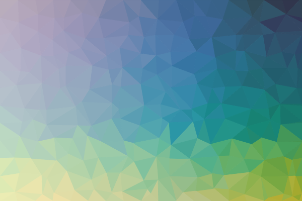

# triangle patterns



Draw triangle patterns on canvas or export to SVG.

## Usage

On canvas:

```html
<canvas id="pattern" height="600" width="400"></canvas>
<script src="triangle-patterns.js"></script>
<script>
    const ctx = document.getElementById('pattern').getContext('2d');
    TrianglePattern({
        width: 600,
        height: 400,
    }).draw(ctx);
</script>
```

Export to SVG:

```html
<script src="triangle-patterns.js"></script>
<script>
    const svg = TrianglePattern({
        width: 600,
        height: 400,
    }).svg();
    
    //...use svg...
</script>
```

## Configuration

```js
{
    //size of initial points mesh (horizontal and vertical)
    meshStepX: 35,
    meshStepY: 35,

    //random seed (same values gives same results)
    seed: 123456,

    //max point position deviation, percent
    variance: 0.05,

    //mesh mode colors
    meshColorStroke: 'black',
    meshColorFill: 'white',

    //color palettes: arrays of colors for horizontal and vertical scales
    //default ColorBrewer colors available: https://github.com/gka/chroma.js/blob/main/src/colors/colorbrewer.js
    //use them with TrianglePattern.colors property, for example:
    //colorsX: TrianglePattern.colors.PuBuGn
    colorsX: TrianglePattern.colors.Oranges,
    colorsY: TrianglePattern.colors.Purples,

    //mix ratio between horizontal and vertical scales
    colorMixRatio: 0.5,

    //use some color styles from TrianglePattern.styles property
    colorStyle: TrianglePattern.styles.default,
    colorStyleJitterIntensity: 0.15,

    colorStyleShadowsIntensity: 0.85,
    colorMode: 'lrgb',
}
```
